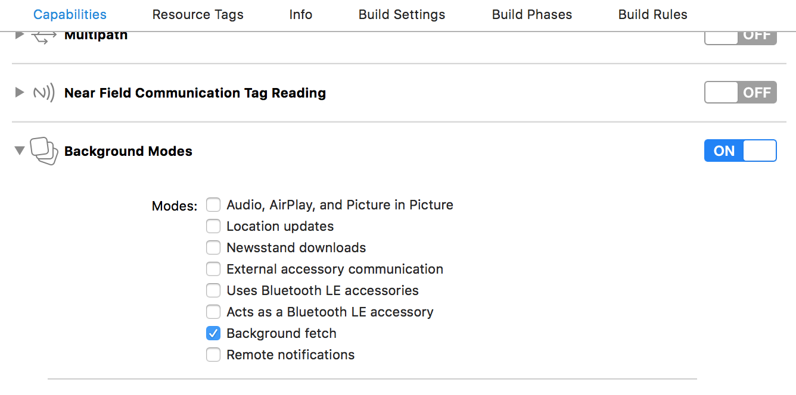

## Manual Installation - iOS

**Read this section ONLY in the case the postlink script fails, or to check that everything worked as expected**

### Edit AppDelegate.m

Edit your project `ios/<app-name>/AppDelegate.m` as follow

- add the following import (after the `React` ones)
```obj-c
// Import 'RNNearIt` headers - Needed by NearIT plugin
#import "RNNearIt.h"
```

- add `RNNearIT` notification handling methods

```obj-c
- (BOOL)application:(UIApplication *)application didFinishLaunchingWithOptions:(NSDictionary *)launchOptions
{
  ...
  // ReactNative initialization code
  ...
  
  // Needed by NearIT plugin - Insert before return YES;
  [RNNearIt registerForRemoteNotifications];
  [RNNearIt application:application didFinishLaunchingWithOptions:launchOptions];

  return YES;
}
...
// Needed by NearIT plugin -- DO NOT REMOVE THIS COMMENT

- (void)application:(UIApplication*) application didRegisterForRemoteNotificationsWithDeviceToken:(NSData *)deviceToken {
  [RNNearIt didRegisterForRemoteNotificationsWithDeviceToken:deviceToken];
}

- (void)application:(UIApplication*) application didReceiveLocalNotification:(UILocalNotification *)notification {
  [RNNearIt didReceiveLocalNotification:notification];
}

- (void)application:(UIApplication*) application didReceiveRemoteNotification:(NSDictionary *)userInfo {
  [RNNearIt didReceiveRemoteNotification:userInfo];
}
```

- add `RNNearIT` background fetch handling method

```obj-c
...
// Needed by NearIT plugin -- Enable Background Updates -- DO NOT REMOVE THIS COMMENT

- (void)application:(UIApplication *)application performFetchWithCompletionHandler:(void (^)(UIBackgroundFetchResult))completionHandler {
  [RNNearIt application:application performFetchWithCompletionHandler:completionHandler];
}

@end
```

### Enable Background Modes capability

Inside Xcode, navigate to the “**Capabilities**” tab of your app. You will need to enable “**Background Modes**” capability and check "***Background fetch***".

